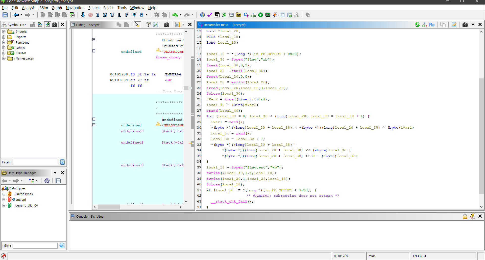
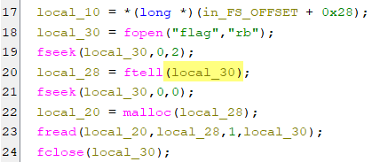
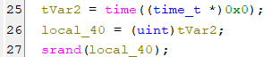
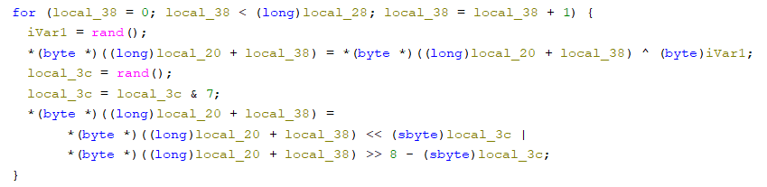
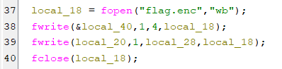
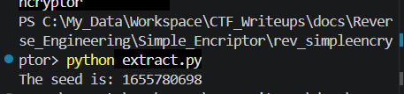
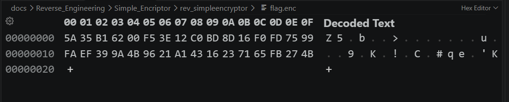
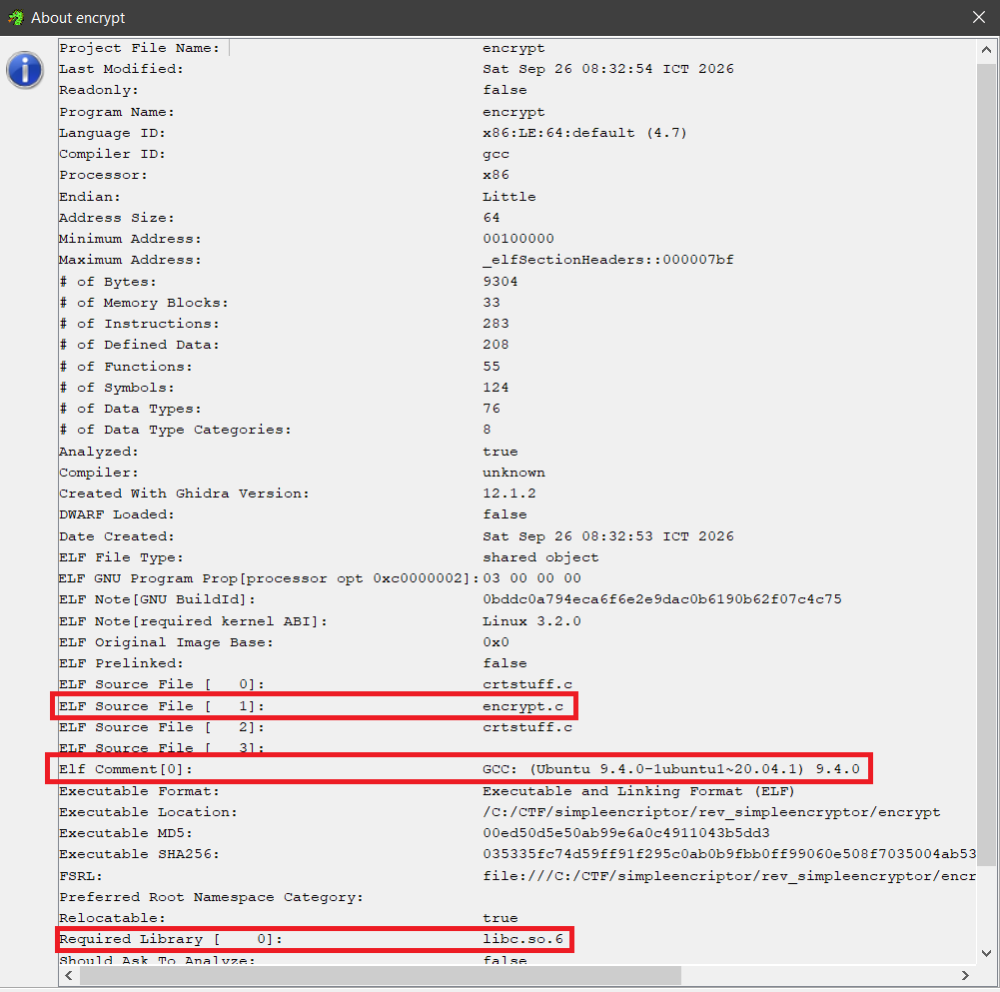
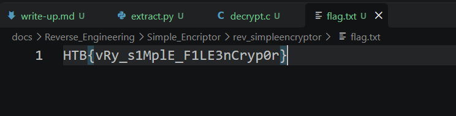

Link to the challenge: [Simple Encryptor](https://app.hackthebox.com/challenges/Simple%2520Encryptor?tab=play_challenge)



first, i put the `encrypt` file inside Ghidra. after that, Ghidra decompiles the binary file back into a c/c++ language code.

after that lets focus on explaining lines of code 



```c
local_30 = fopen("flag","rb");
fseek(local_30,0,2);
local_28 = ftell(local_30);
fseek(local_30,0,0);
local_20 = malloc(local_28);
fread(local_20,local_28,1,local_30);
fclose(local_30);
```

this part can be understood as opening a file stream, allocating memory for the file content, reading the content into memory, and then closing the file stream.

---



```c
tVar2 = time((time_t *)0x0);
local_40 = (uint)tVar2;
srand(local_40);
```

`time((time_t *)0x0)` means `time(NULL)` which returns the current time in seconds since the epoch `January 1, 1970`. 

This value is then used to seed the random number generator with srand `local_40`.

How `srand()`, `rand()`, and `time()` work will be explained in [Fundamentals/re_101.md](../Fundamentals/re_101.md#how-srand-rand-and-time-work).

---



```c
for (local_38 = 0; local_38 < (long)local_28; local_38 = local_38 + 1) {
  iVar1 = rand();
  *(byte *)((long)local_20 + local_38) = *(byte *)((long)local_20 + local_38) ^ (byte)iVar1;
  local_3c = rand();
  local_3c = local_3c & 7;
  *(byte *)((long)local_20 + local_38) =
        *(byte *)((long)local_20 + local_38) << (sbyte)local_3c |
        *(byte *)((long)local_20 + local_38) >> 8 - (sbyte)local_3c;
}
```

main part of the encryption algorithm is a for loop that iterates through each byte of the file content stored in `local_20`.

I can rewrite the code in a more readable way:

```c
  for (int i = 0; i < file_size; i++) {
    int random_value = rand();
    file_content[i] ^= (byte)random_value; // XOR operation with a random value
    int shift_amount = rand() & 7;
    file_content[i] = (file_content[i] << shift_amount) | (file_content[i] >> (8 - shift_amount)); // Bitwise rotation
  }
```

**So basically the encryption algorithm goes like this:**

1. XOR each byte with random_value.

2. Bitwise rotate the result by shift_amount.

**We can reverse the encryption process like this:**

1. Bitwise rotate the encrypted byte by (8 - shift_amount).

2. XOR the result with the same random_value.

---



```c
local_18 = fopen("flag.enc","wb");
fwrite(&local_40,1,4,local_18);
fwrite(local_20,1,local_28,local_18);
fclose(local_18);
```

after we know how the encryption algorithm works & how to reverse it, we just need to know what is the random value (seed) that was used to encrypt the file.

luckily, the program saves the seed value `local_40` into the first 4 bytes of the encrypted file `flag.enc`. 

now the only thing left to do is to read the first 4 bytes of the encrypted `flag.enc` file, and use that value to seed the random number generator again, and then we can decrypt the file by reversing the encryption process.

i can extract 4 bytes from the encrypted `flag.enc` file by writing a simple script in python:

```python
import struct
with open('flag.enc', 'rb') as f:
    # Read 4 bytes, unpack as Little-Endian (<) Unsigned Integer (I)
    seed = struct.unpack('<I', f.read(4))[0] 
    print(f"The seed is: {seed}")
```

The result of the script:



So the seed is `1655780698`. I can check if this is correct by reading `flag.enc` file using a hex editor.



we can see that the first 4 bytes of the `flag.enc` file is `5A 35 B1 62`.

however, the value is stored in Little-Endian format, so we need to reverse the byte order to get the correct seed value.

-> The correct seed value is `62 B1 35 5A` in hex, which is `0x62B1355A = 1655780698` in decimal.

---

After we have the seed value, we can use it to seed the random number generator again and then decrypt the file by reversing the encryption process.

I wrote a simple C script to do this:

```c
#include <stdio.h>
#include <stdlib.h>
#include <stdint.h>


int main() {
    // Read the encrypted file
    FILE *file = fopen("flag.enc", "rb"); 
    fseek(file, 0, SEEK_END);
    long file_size = ftell(file);
    fseek(file, 0, SEEK_SET);
    uint8_t *file_content = malloc(file_size);
    fread(file_content, 1, file_size, file);
    fclose(file);

    srand(1655780698); // Seed the random number generator with the known seed

    // Decrypt the file
    // Notice that the first 4 bytes of the file (0 - 3) are the seed value and didn't get encrypted -> we start from 4.
    for (int i = 4; i < file_size; i++) {
        int random_value = rand(), shift_amount = rand() & 7;
        file_content[i] = (file_content[i] >> shift_amount) | (file_content[i] << (8 - shift_amount)); // Reverse bitwise rotation
        file_content[i] ^= (uint8_t)random_value; // XOR operation with the same random value
    }

    FILE *output_file = fopen("flag.txt", "wb");

    fwrite(file_content + 4, 1, file_size - 4, output_file); // Print ONLY the decrypted content into flag.txt
    fclose(output_file);
    free(file_content);

    return 0;
}
```

This part i bumped into a problem. Because `encrypt` is a Linux ELF binary, it uses the `glibc` implementation of `rand()`.



I ran `decrypt.c` on Windows, but the `rand()` implementation on Windows uses `ucrtbase.dll` implementation, which is different from the one in `glibc`. So the decrypted content is not correct.

because of that I ran `decrypt.c` in WSL. We found the flag.



**Flag:**                                    
```text                                      
HTB{vRy_s1MplE_F1LE3nCryp0r}                 
```   