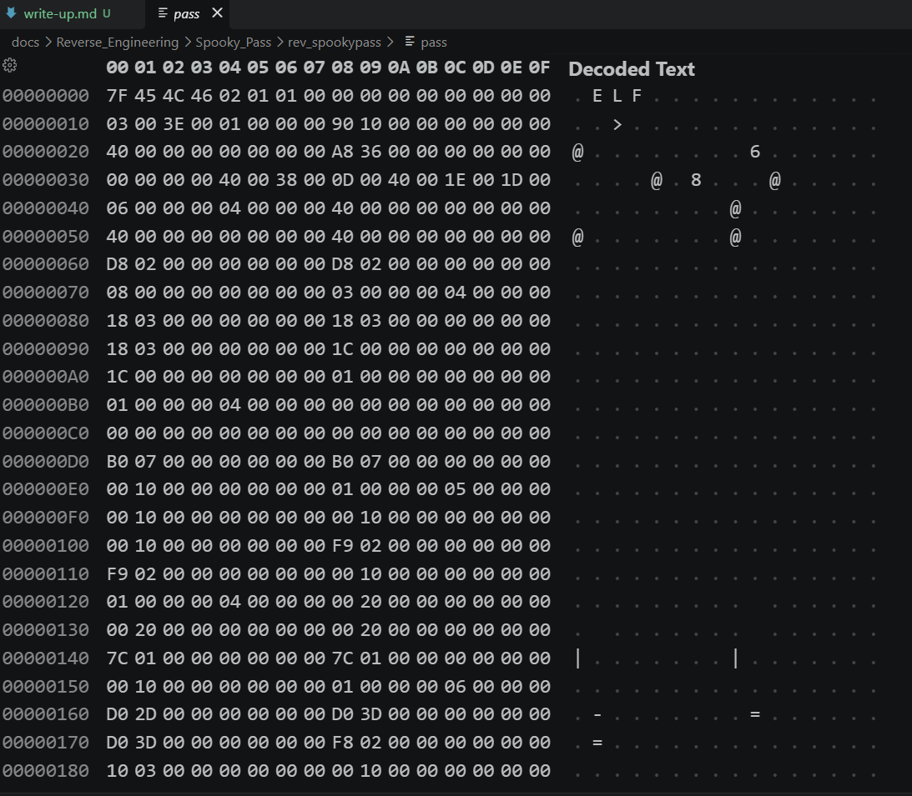
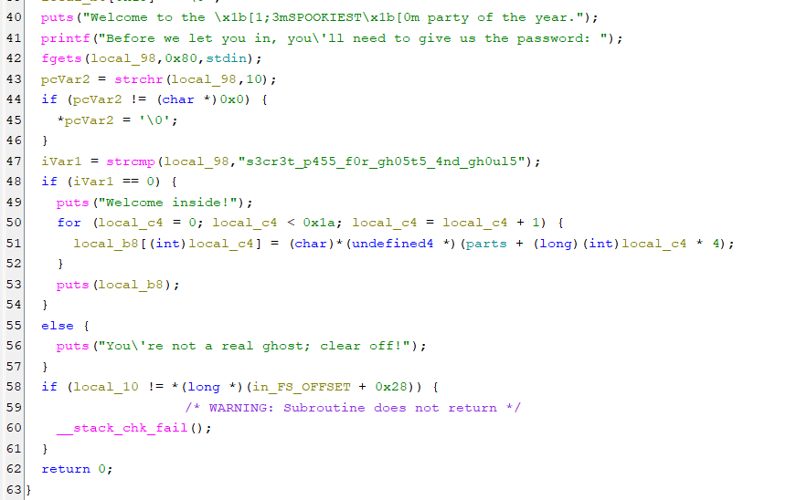
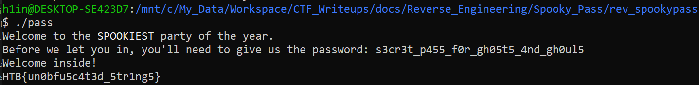
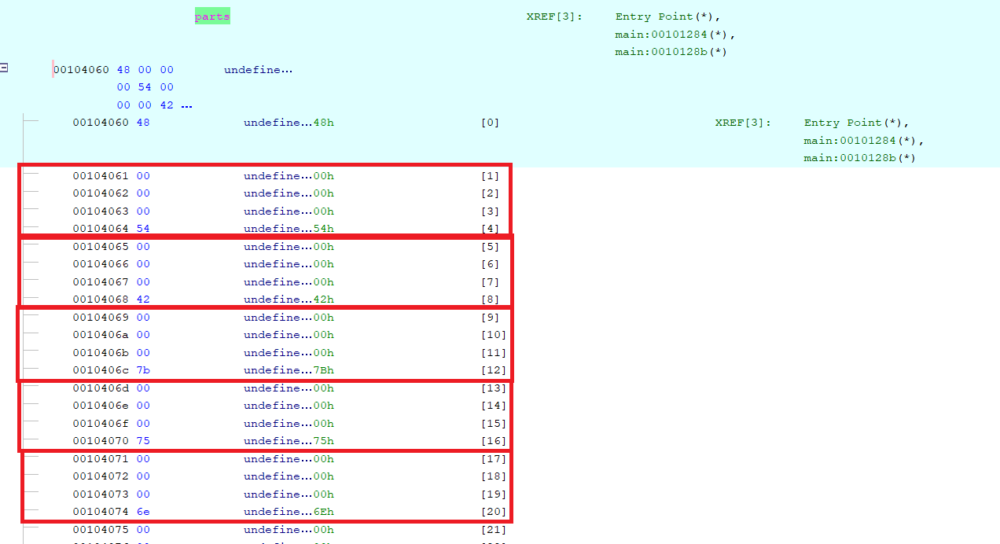
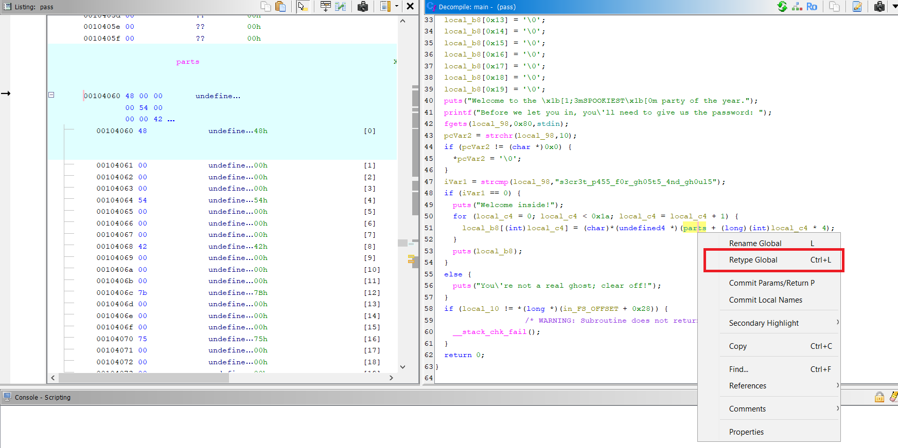
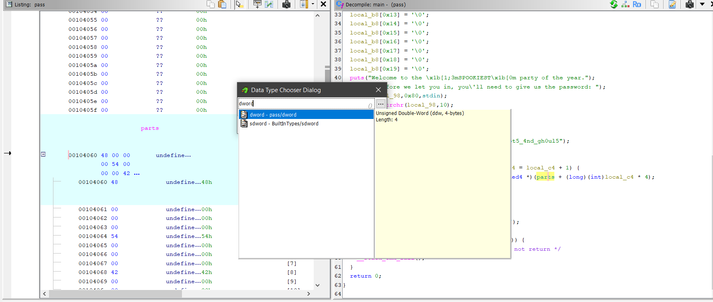
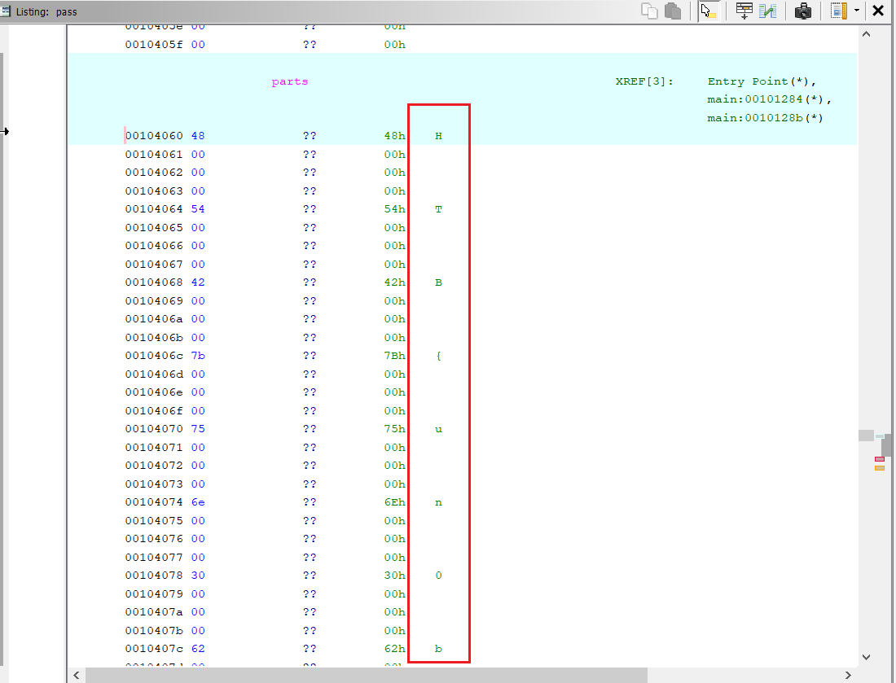

> **Platform:** Hack The Box       
> **Category:** Reverse Engineering         
> **Difficulty:** Very Easy        
> **Challenge Link:** [Spooky Pass](https://app.hackthebox.com/challenges/SpookyPass?tab=play_challenge)  

First impression:

I opened the `pass` file using hex editor and found that it was an ELF (Executable and Linkable Format) file.



We can see `7F 45 4C 46` or `ELF` in the first 4 bytes of the file. This is a common signature for ELF files.

So I put the `pass` file inside Ghidra. after that, Ghidra decompiles the binary file back into a c/c++ language code.



*P.S. We can see the password right away in the hex editor. But for the sake of learning, let's continue with reading the decompiled code.*

---

Let's analyze the decompiled main function:

```c
puts("Welcome to the \x1b[1;3mSPOOKIEST\x1b[0m party of the year.");
printf("Before we let you in, you\'ll need to give us the password: ");
fgets(local_98,0x80,stdin);
pcVar2 = strchr(local_98,10);
if (pcVar2 != (char *)0x0) {
*pcVar2 = '\0';
}
iVar1 = strcmp(local_98,"s3cr3t_p455_f0r_gh05t5_4nd_gh0ul5");
if (iVar1 == 0) {
puts("Welcome inside!");
for (local_c4 = 0; local_c4 < 0x1a; local_c4 = local_c4 + 1) {
    local_b8[(int)local_c4] = (char)*(undefined4 *)(parts + (long)(int)local_c4 * 4);
}
puts(local_b8);
}
else {
puts("You\'re not a real ghost; clear off!");
}
```

The program logic is simple:

1. Print a welcome message & ask for the password.

2. Compare the password with `s3cr3t_p455_f0r_gh05t5_4nd_gh0ul5`.

3. If the password is correct, print "Welcome inside!" and `local_b8` which is constructed from `parts` array.

`local_b8` is 99% sure the flag. There are two ways to get the flag.

First way is to run the program and input the correct password.



---



The second way is to get the flag from the `parts` array. The `parts` array is located at 00104060. The current data stored inside is undefined, so I'm gonna give it the type `dword` - we can easily see the pattern of 0 bytes -> each value is 4 bytes (for more details on basic data types, go to [Fundamentals/re_101.md](../Fundamentals/re_101.md#basic-data-types-and-sizes)).

So I changed the type of `parts` to `dword` and then I can see the values stored inside.







**Flag:**                                    
```text                                      
HTB{un0bfu5c4t3d_5tr1ng5}                 
```  